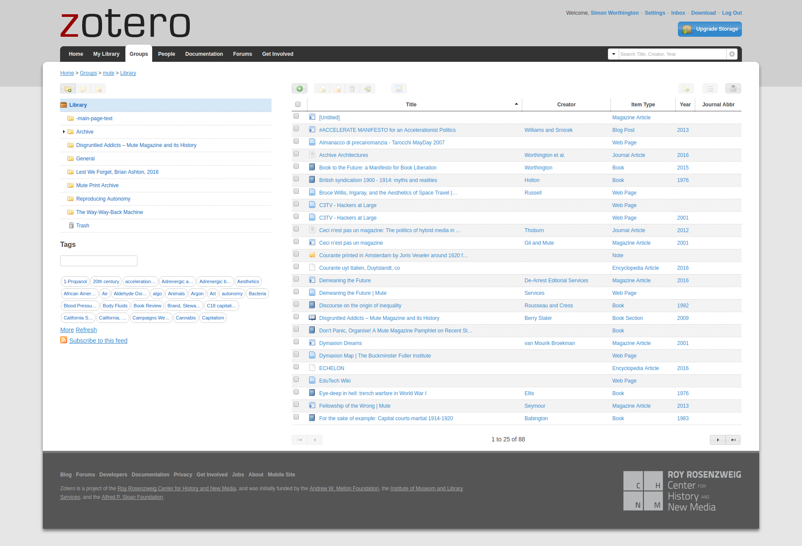
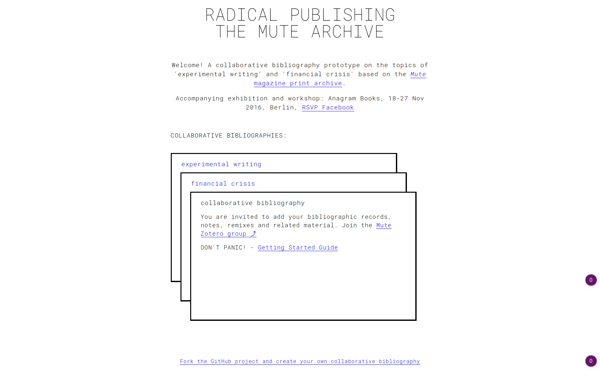

# READ ME!

# Mute Archive Plan

The [Mute Archive Plan](mute-archive-plan.md) (2022/23) covers archiving Mute's work, publications, and projects. 

See the '[discussion](https://github.com/orgs/Mute-Publishing/discussions)', '[Project Tasks](https://github.com/orgs/Mute-Publishing/projects/1), and [Guide to archiving](mute-archive-guide.md)

## Collaborative Bibliographies: Radical Publishing - The Mute Archive
An experimental project using articles from the [Mute Magazine Print Archive](http://www.metamute.org/editorial/books/mute-magazine-print-archive) to look at archive remix-publishing, as part of a [residency](https://www.facebook.com/events/187497858364325/) at Anagram Books, Berlin, Nov 2016. Two subject have been chosen for residency 'Experimental Writing' and 'Financial Crisis'. Online and offline collaborative bibliographies will be made on these topics using material from the Mute archive. Watch this space '[Radical Publishing: The Mute Archive](https://mute-publishing.github.io/archive/)' — join in, contribute or drop in .

The online collaborative bibiographies setup connects Zotero (a collaborative sources manager) to a real-time, live updating, website using GitHub (a code repository). In a nutshell, if you edit items in Zotero and the website gets refreshed.

The result is that we turn A into B. A. Zotero service => B. Website

NB: This is a PROTOTYPE project, so expect glitches - they're features not bugs :-), joking. Support requests, bugs, feature requests - please post to the [issues](https://github.com/Mute-Publishing/archive/issues) area on GitHub in the menu-tab above.

## Guides

See the **[Getting Started Guide](https://github.com/Mute-Publishing/archive/blob/gh-pages/getting-started-guide.md)** for a step-by-step introduction.

**Fast Track** - if you want to get cracking then follow these steps, make a [Zotero account](https://www.zotero.org/user/register/), join the [Mute Group](https://www.zotero.org/groups/mute) and start editing items in the sub-folders of the [archive](https://www.zotero.org/groups/mute/items/collectionKey/93KX44QJ) folder. Then refresh the [Collaborative Bibliographies](https://mute-publishing.github.io/archive/) website and your items are live.

## Ideas Being Prototyped

We want to explore what can be done with collaborative bibliographies in an Open-Web context and how this can be used to support radical publishing communities.

Mute in collaboration with the [Hybrid Publishing Group](https://hpg.io) (HPG) is using the [Mute Magazine Print Archive](http://www.metamute.org/editorial/books/mute-magazine-print-archive) as a content repository to source from for the overall project.

Using Zotero free and open source software as the foundational tool and we are looking at these example questions;

+ Publication Remixing - trying out a different publication workflow production architectures for making works. As an example putting aside the ususal process - idea, publisher, publication - and replacing it with - material, group, context = ?
+ Online Community Librarianship - creating expert content packages on a question or topic.
+ Road Testing Existing Tech Stack - looking at how existing free and open source (FOSS) modules can be bent to the projects interests.

## Tech Stack
Not all of these parts have been employed and connected, but this is what is in mind to explore.

The modules are used to create a combination of three knowledge galaxies (McLuhan) — DIY archive setup, flat file architecture option, and collaborative bibliographies/sources.

Zotero is the key area of focus for this phase of the project, Q3 '16. A little Zotero history. Zotero is from the Roy Rosenzweig Center for History and New Media (RRCHNM) at George Mason University, Virginia, US http://chnm.gmu.edu/research-and-tools/ . Also see Roy Rosenzweig memorial http://thanksroy.org/about .

Where possible software is free and open source.

+ DIY Scanning - ScanTailor, ScanBot (Android App)
+ Image Deep Zooming and Deep Linking - IIIF and OpenLayers
+ File Storage - GitHub, GitHub LFS, BaseX
+ Transformation - Transpect, VivlioStyle
+ Editing, Workflow - Fidus Writer
+ Bibliography and Sources - Zotero
+ Metadata - Ontotext
+ Website - GitHub Pages, Jekyll
+ Interactive UI - Hybrid Player (HPG) and TimeLineJS (knight lab)

## Exhibition and Events
The project has been kicked off by a [residency](https://www.facebook.com/events/187497858364325/) (Nov '16) titled '[Radical Publishing: The Mute Archive](https://mute-publishing.github.io/archive/)' at [Anagram Books](http://www.anagrambooks.com/), Berlin, by Simon Worthington of Mute.

The residency takes place over ten days, with an opening on the 18th Nov. '16. Over the residency period a series of collaborative bibliographies will be made on the topics of 'experimental writing' and 'financial crisis' from the contents of Mute's archive. This will result in an online and offline catalogue. On the 25th Nov. a workshop will be held 'Publishing from the Archive' to expore and discuss the ideas around potentials for collaborative bibliographies and remix archive-publishing. The workshop will also include tutoriing on the basics of Zotero use.

It is anticipated that further events will follow at later dates.

## Acknowledgements
The project is a collaboration between [Mute](http://www.metamute.org/) and the [HPG](https://hpg.io), with support from [Anagram Books](http://www.anagrambooks.com/).

The technical project is based on project prototype called Collaborative Libraries run by HPG for the [BookCamping](http://bookcamping.cc/) group at [Media Lab Prado](http://medialab-prado.es/). HPG collaborated with [Xm:lab](http://www.xmlab.org/news/) to develop and produce the project as part of a joint commission Hidden Historiesand which was funded by the [Connecting Cities](http://connectingcities.net/) curatorial programme 2015.

Special thanks goes to [Loraine Furter](http://lorainefurter.net/) who made the software to connect Zotero and GitHub Pages, as well as designing the interface.

See the orginal 'Collaborative Library' prototype project here https://github.com/consortium/Collaborative-Libraries

All content from Mute is anti-copyright. All other content and sofware is copyright the author and open and free under its existing licence.
