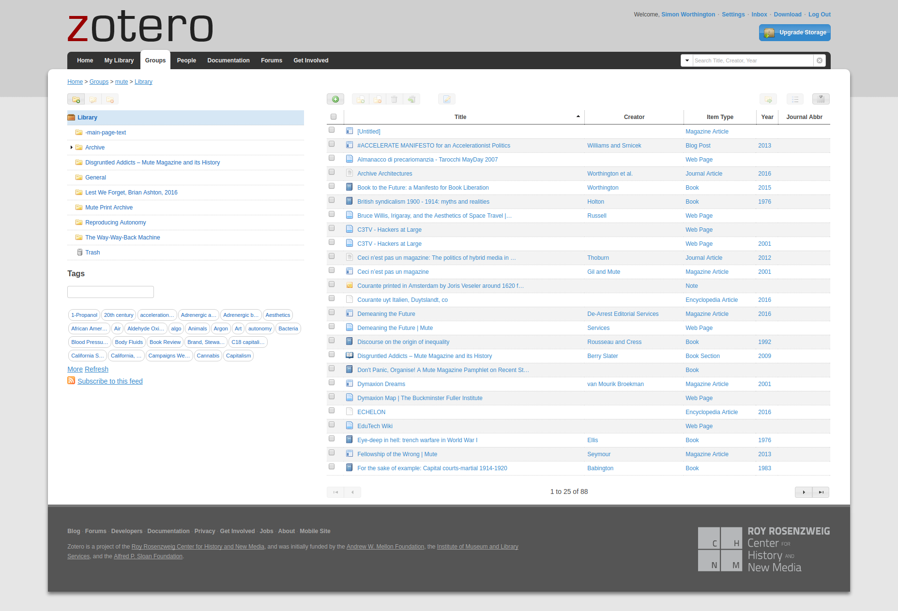
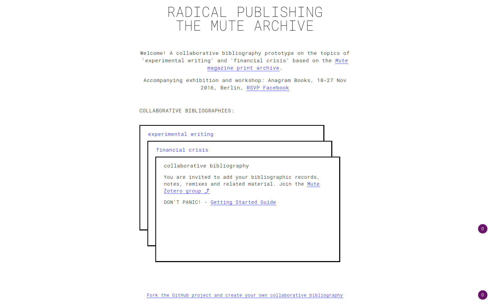
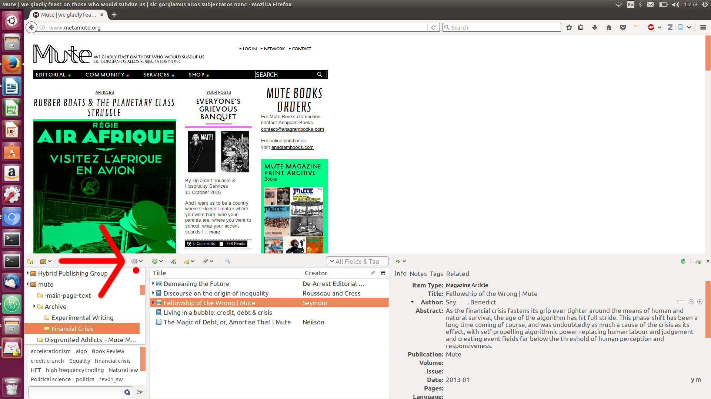
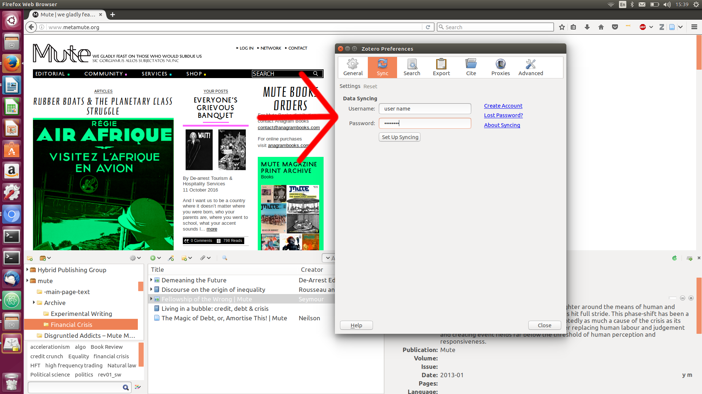
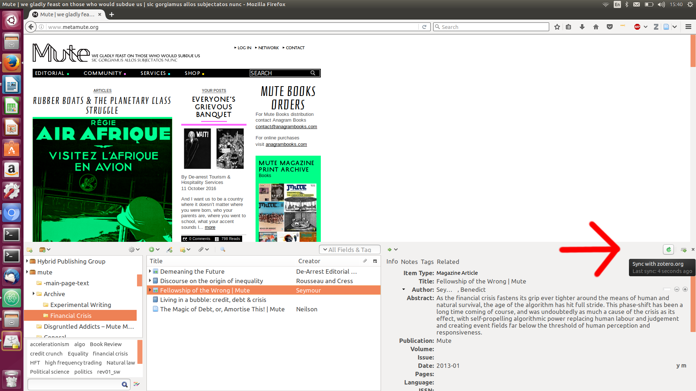
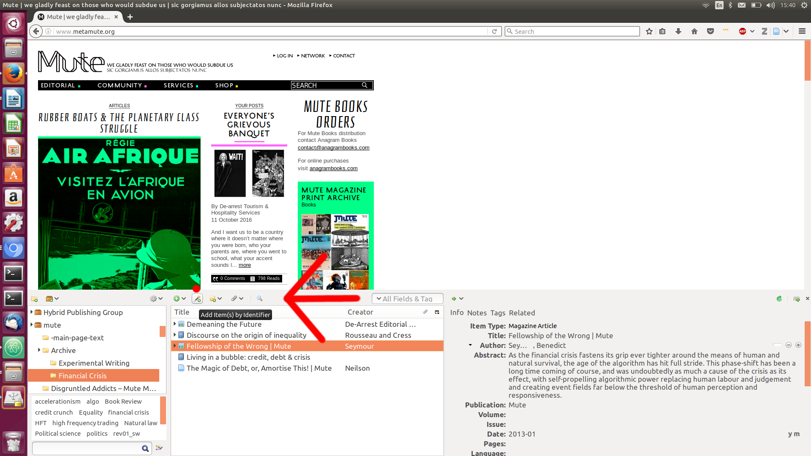

# Getting Started Guide

## About Collaborative Bibliographies: Radical Publishing - The Mute Archive
An experimental project using articles from the [Mute Magazine Print Archive](http://www.metamute.org/editorial/books/mute-magazine-print-archive) to look at archive remix-publishing, as part of a [residency](https://www.facebook.com/events/187497858364325/) at Anagram Books, Berlin, Nov 2016. Two subject have been chosen for residency 'Experimental Writing' and 'Financial Crisis'. Online and offline collaborative bibliographies will be made on these topics using material from the Mute archive. Watch this space '[Radical Publishing: The Mute Archive](https://mute-publishing.github.io/archive/)' — join in, contribute or drop in .

The online collaborative bibiographies setup connects Zotero (a collaborative sources manager) to a real-time, live updating, website using GitHub (a code repository). In a nutshell, if you edit items in Zotero and the website gets refreshed.

The result is that we turn A into B. A. Zotero service => B. Website




## The Guide

In setting up the use of the Collaborative Bibliographies website based on the Zotero service we'll cover these three items, these will be all you need to set you on your way;

+ adding a Mute magazine article
+ adding an external source, in this case a book, but it could be anything
+ adding a comment

### A. Join the Mute Zotero Group

Groups on Zotero are collaborative 'bibliography and sources' catalogs. 

1. Go to the [Zotero website](https://www.zotero.org/) and register. You'll need to verify your account via email and then login.
2. On the Zotero website join the ['Mute group'](https://www.zotero.org/groups/mute). Navigate to the ['Group Library'](https://www.zotero.org/groups/mute/items) and you will see all the items in the group.

### B. Add a Mute Magazine Article

First find an article in the [Mute Magazine Print Archive](http://www.metamute.org/editorial/books/mute-magazine-print-archive) that you would like to add to the collaborative bibliography. In this example we'll use the [The Metamap](http://www.metamute.org/editorial/articles/metamap-pull-out-global-map-charting-surveillance-and-privacy-projects) article from Mute. Have the articles web page tab open in your browser.

On the Zotero website navigate to the folder you want to add it to in the Group Library and select it, you wil see the items already in the folder.

The folders in the Mute Group for the collaborative bibliography are arranges like so:

```
Archive/

Archive/Experimental Writing/

Archive/Financial Crisis/
```

Now you can add your article using the green button above the title field of the item list.  First you will be prompted to select its item type, in this case choose 'Magazine Article', then you will be presented with a list of items, fill them out as best you can and save.

To view your new addition on the webite for the collaborative bibliography load the site https://mute-publishing.github.io/archive and your item will be in the appropriate list. Since we added The Metamap to [Experimental Writing](https://mute-publishing.github.io/archive/experimental-writing.html) collection we can see it listed there.

### C. Adding Other Sources; Books, or Anything Else.

Any item type can be added via the Zotero website as you just did with a Mute magazine article. But Zotero has other ways by which items can be added — a browser plugin, standalone desktop version and mobile apps — details are on the [Zotero download](https://www.zotero.org/download/) page.

We'll use the browser plugin ['Beta 5.0'](https://www.zotero.org/support/dev_builds#zotero_50_beta) for Firefox (Nov '16). The reason for using the browser plugin and standalone versions is that they have more functionality. In this case we want to show off 'add by identifier' where Zotero will auto-complete an items fields from external databases, when an identifier like ISBN, ISSN or DOI is used.

1. Install the [Zotero browser plugin](https://www.zotero.org/download/) of your choice. 
2. Then you need to log the browser plugin into your Zotero account you created earlier. In Firefox this is done via the Tools menu > Zotero (other browsers will do this differently). A Zotero window will appear at the bottom of your browser. Top left of this window is a cog icon, indicating preferences. Click on the cog, the dropmenu shows prefereneces as an option, select it and go to the sync tab and here you can input your user name and password.




3. To synch your online Zotero account to your local browser click the green circular arrow icon to the top right of the Zotero window on the bottom half of your browser. Your content is now synched. This can be done at any time. Other users edits will show up in your local library when you synch.



4. First navigate to the folder you want to add the item too. Then to add your book source enter the book ISBN, e.g. 9781906496364 from the [Book Liberation Manifesto](https://research.consortium.io/docs/book_liberation_manifesto/Book_Liberation_Manifesto.html) (Worthington), into the 'add item by identifier' icon. This icon is a 'magic wand icon' on the Zotero top bar in browser. Zotero will add what fields it can and you can edit the rest.



5. To finish your addition, synch Zotero. The refresh the collaborative bibliography website and you will see your item on the site.

6. NB: If you place an item in the wrong folder in Zotero it can simply be moved by using the drag-and-drop function in the browser panel.

### D. Adding Comments

Comments allow the use of full HTML which means you can add elaborate annotation and especially content from accross the Web, pictures, et al.

Comments can be added as stand-alone notes or more usually associated to an item. Here we'll add a comment to an item The Metamap.

1. In the Web interface of Zotero navigate to your item e.g. ['The Metamap'](https://www.zotero.org/groups/mute/items/collectionKey/IU5PRPJR/itemKey/V97823C5).
2. Enable item editing using the 'paper and pencil' icon top, middle.
3. Scroll to the bottom of the edit window and click 'Add Note'. Here you can edit away and add pictures using copy-paste as long as the images can be accessed on the Web. Save and your done. Here is the example comment addition to ['The Metamap'](https://www.zotero.org/groups/mute/items/collectionKey/IU5PRPJR/itemKey/Q3EMXB8P).

Zotero is feature rich. Please explore!

Any questions or comments add them to the issues area and if you have an edit for this guide please just add it.

End


